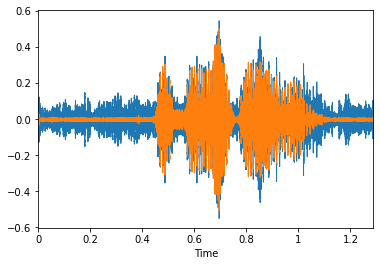

# Описание приложения
Данное приложение разработано для улучшения качества аудио и голосовых сообщений,
путем уменьшения уровня шума. Оно основано на технологии обработки звука с помощью свёрточных нейронных сетей.

MVP реализовано в виде телеграмм-бота. Для использования необходимо записать голосовое сообщение с частотой дискретизации 48 кГц и отправить его боту. 
После обработки, бот отправляет обработанное сообщение с частотой дискретизации 16 кГц и уменьшенным уровнем шума.

Данное приложение может быть полезно для людей, которые часто общаются посредством голосовых сообщений, но сталкиваются с проблемой шумов на записи.
Также приложение может использоваться для обработки аудио записей и улучшения их качества.

# Пример

# Инструкция для поднятия собственного Telegram бота
## Скачивание проекта
1. Скачайте проект с GitLab, используя кнопку "Download" или команду `git clone` в терминале

## Создание токена для телеграм бота
2. Создайте токен для телеграм бота, используя официальное приложение Телеграмм
3. Скопируйте токен

## Интеграция токена в проект
4. Откройте проект в любом редакторе кода
5. Создайте файл `config.py` в корневой папке проекта 
6. Вставьте скопированный токен в кавычки после `TOKEN =`

## Создание докер образа 
7. Установите Docker на свой компьютер 
8. Введите команду `docker build -t имя_образа .`, чтобы создать докер образ с текущим именем 

## Запуск контейнера 
9. Запустите контейнер командой: 
`docker run -d имя_образа`
10. Откройте диалог со своим созданным ботом и запишите ему голосовое сообщение, чтобы убедиться, что контейнер запущен успешно

## Результат
Ваш Telegram бот готов для работы!

# Используемые библиотеки
1. Tensorflow - для создания нейросети. 
2. Aiogram - для работы с телеграм апи.
3. FFMPEG - для смены частоты дискретизации аудио

# Архитектура
Архитектура нейронной сети похожа на Unet/SegNet. 
SegNet или Unet являются типичными архитектурами сверточных нейронных сетей, используемых 
для обработки изображений. Они состоят из энкодера, который служит для извлечения значимых признаков 
из исходного изображения, и декодера, который используется для сжатия этих признаков и восстановления на выходе.

Для обработки звука эти архитектуры могут использоваться для улучшения качества записи, устранения шума и других артефактов звука. 

# Эксперименты
1. Я пробовал использовать предобученную модель, для сегментации голоса, чтобы в промежутки без речи занулить шум. 
Проблема в том, что иногда ошибка в сегментации приводила к обрезанию голоса человека на записи.
2. Я хотел попробовать, учить модель не только отчищать запись от шума, но еще и производить сегментацию на наличие голоса. Считаю, что если все сдеалть правильно, это может улучшить качество. 
